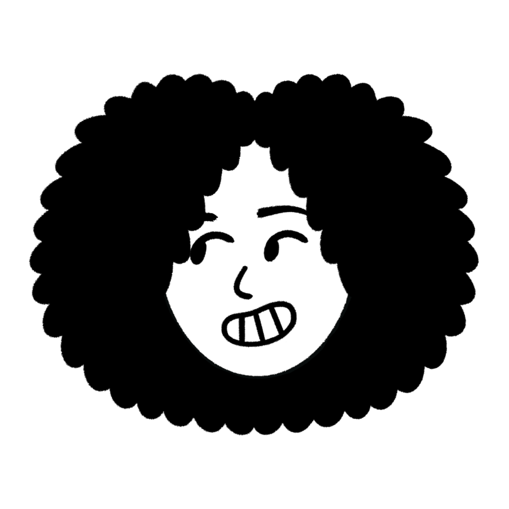

<picture> </picture>

  <ul align="left">
    
<h1 style="display: inline-block">Hi, I'm Raquel ✌️</h1>

  </ul>

<h3 align="left"><b>Exploring QA & DevOps | Always learning</b></h3>

  

👩🏻‍💻 Exploring QA & DevOps while learning ISTQB Foundation Level  
💡 Curious about software quality, usability, and how things work behind the scenes  
🌱 Sharing my learning journey and experiments in tech  
💭 Currently studying **ISTQB Foundation Level** and exploring DevOps tools  

  <ul align="left">
    
<h2 style="display: inline-block">Tools</h1>

  </ul>

  <ul align="left">
    
<h2 style="display: inline-block">Contact</h1>

  </ul>

[LinkedIn](https://www.linkedin.com/in/raquel-garcia-rachon/) | [Email](mailto:rgarciarachon@gmail.com)

#### 
<b>Made with ✨ by Raquel From Huelva, always exploring</b>

